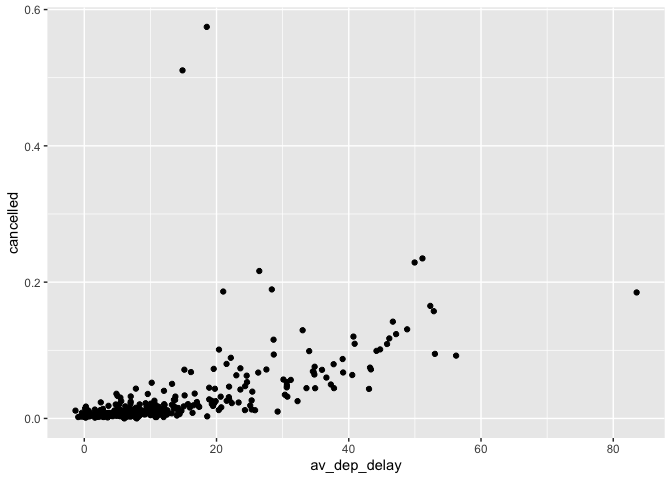

Homework 2
================
Erika Park
9/28/2021

``` r
library(dplyr)
library(nycflights13)
library(ggplot2)
```

#### 1\. How many flights have a missing dep\_time? What other variables are missing? What might these rows represent?

  - The flights with missing dep\_time also have missing arr\_time.
  - Since both departure time and arrival time are missing for the
    flights, it seems like the flights are the cancelled flights.
  - Since there are 8255 rows, there seem to be 8255 cancelled flights.

<!-- end list -->

``` r
filter(flights, is.na(dep_time))
```

    ## # A tibble: 8,255 × 19
    ##     year month   day dep_time sched_dep_time dep_delay arr_time sched_arr_time
    ##    <int> <int> <int>    <int>          <int>     <dbl>    <int>          <int>
    ##  1  2013     1     1       NA           1630        NA       NA           1815
    ##  2  2013     1     1       NA           1935        NA       NA           2240
    ##  3  2013     1     1       NA           1500        NA       NA           1825
    ##  4  2013     1     1       NA            600        NA       NA            901
    ##  5  2013     1     2       NA           1540        NA       NA           1747
    ##  6  2013     1     2       NA           1620        NA       NA           1746
    ##  7  2013     1     2       NA           1355        NA       NA           1459
    ##  8  2013     1     2       NA           1420        NA       NA           1644
    ##  9  2013     1     2       NA           1321        NA       NA           1536
    ## 10  2013     1     2       NA           1545        NA       NA           1910
    ## # … with 8,245 more rows, and 11 more variables: arr_delay <dbl>,
    ## #   carrier <chr>, flight <int>, tailnum <chr>, origin <chr>, dest <chr>,
    ## #   air_time <dbl>, distance <dbl>, hour <dbl>, minute <dbl>, time_hour <dttm>

#### 2\. Currently dep\_time and sched\_dep\_time are convenient to look at, but hard to compute with because they’re not really continuous numbers. Convert them to a more convenient representation of number of minutes since midnight.

  - We need to split out the numbers.
  - We first need to divide by 100 and discard the remainder. The number
    would represent the hours. The number needs to be multiplied by 60
    to convert to minutes.
  - The remainder would be the minutes.
  - Midnight is represented by 2400, which is 1440 minutes. This should
    correspond to 0.

<!-- end list -->

``` r
flights %>%  
  mutate(dep_time_mins = (dep_time %/% 100 * 60 + dep_time %% 100) %% 1440,
  sched_dep_time_mins = (sched_dep_time %/% 100 * 60 + sched_dep_time %% 100) %% 1440) %>% 
  select(dep_time, dep_time_mins, sched_dep_time,sched_dep_time_mins)
```

    ## # A tibble: 336,776 × 4
    ##    dep_time dep_time_mins sched_dep_time sched_dep_time_mins
    ##       <int>         <dbl>          <int>               <dbl>
    ##  1      517           317            515                 315
    ##  2      533           333            529                 329
    ##  3      542           342            540                 340
    ##  4      544           344            545                 345
    ##  5      554           354            600                 360
    ##  6      554           354            558                 358
    ##  7      555           355            600                 360
    ##  8      557           357            600                 360
    ##  9      557           357            600                 360
    ## 10      558           358            600                 360
    ## # … with 336,766 more rows

#### 3\. Look at the number of cancelled flights per day. Is there a pattern? Is the proportion of canceled flights related to the average delay? Use multiple dyplr operations, all on one line, concluding with ggplot(aes(x= ,y=)) + geom\_point()

  - One pattern that I noticed with the data is that with the total
    number of flights each day, the number of cancelled flights rises.

<!-- end list -->

``` r
flights %>%
  mutate(cancelled = (is.na(arr_delay) | is.na(dep_delay))) %>%
  group_by(year, month, day) %>%
  summarise(
    cancelled = mean(cancelled),
    av_dep_delay = mean(dep_delay, na.rm = T),
    av_arr_delay = mean(arr_delay, na.rm = T)
  ) %>% 
  ggplot(aes(x = av_dep_delay, y = cancelled)) + geom_point()
```

<!-- -->

  - By looking at the plot, strong relationship is visible between
    average departure delay and proportion of cancelled flights.
  - Except a few outliers, we can see that the departure delay is
    positively related to the proportion of cancelled flights.
